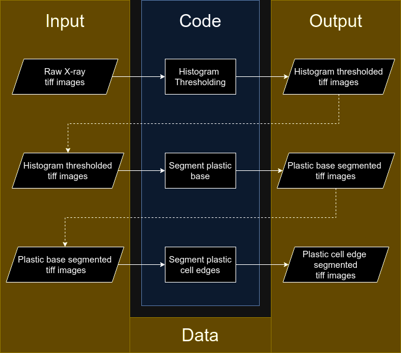

# Honeycomb Analysis
A repository for code associated with the paper “Adaptive cell size, merging, tilting and layering in honeybee comb construction”.

## Introduction
This repository contains code to process 3D X-ray microscopy scans of honeycomb samples, which are obtained experimentally. A detailed explanation of the experiments is provided in the paper.

The data associated with this paper can be found on [Dryad](https://nam10.safelinks.protection.outlook.com/?url=https%3A%2F%2Fdatadryad.org%2Fstash%2Fshare%2FpflxOKajIcjTEz7Dx96fi7UYI_7bREHUscUpACinx0s&data=05%7C02%7CChethan.KavaraganahalliPrasanna%40colorado.edu%7C21b6e11ac5214fa40a5808dc73bf5fb6%7C3ded8b1b070d462982e4c0b019f46057%7C1%7C0%7C638512514073002680%7CUnknown%7CTWFpbGZsb3d8eyJWIjoiMC4wLjAwMDAiLCJQIjoiV2luMzIiLCJBTiI6Ik1haWwiLCJXVCI6Mn0%3D%7C0%7C%7C%7C&sdata=Cnhz79zhk1V%2BnNV9HLWSJvCdM7caCzj7TyOj8JKi27E%3D&reserved=0).

The objective of the image processing pipeline in this repository is to transform the raw X-ray microscopy data into a form that is more amenable to visualization and further analysis. To this end, the code in this repo processes the TIFF image stack obtained from X-ray microscopy. The image processing is divided into three main stages, which are explained below:
* **Histogram Thresholding:** In this step, the raw X-ray microscopy TIFF images in a dataset are processed to filter out pixels corresponding to air (background), leaving only those pixels corresponding to honeycomb and plastic (foreground).
* **Plastic base segmentation:** In this step, the histogram thresholded images are processed to filter out the plastic starter base, leaving only the honeycomb and plastic cell edges.
* **Plastic cell edges segementation:** In this step, the resultant images from the previous step are processed to segement cell edges for visualization purposes.

An elaborate account of these processing stages in provided in the SI for the paper.

The code is organized so that each of these stages can be run separately on the desired dataset. A visual schematic of the code flow is provided below:



Further details about how to run the code is provided below.

## How to use the code
Before the code can be run, a python environment with the necessary packages installed needs to be set up. The steps to do this setup is provided below.

### Setup
A recent version of Python 3 needs to be installed on the system to run this project. All the code that is present in this repository has been developed and tested on `Python 3.10.12`. Python 3 can be installed using this [guide](https://wiki.python.org/moin/BeginnersGuide/Download) as reference. `pip` should be automatically installed along with Python. However, if it is not installed, this [guide](https://pip.pypa.io/en/stable/installation/) can be used to install it.

Once Python 3 is installed, it is **highly recommended**, nevertheless *optional* to setup a virtual environment in Python to run this project. To do this, `virtualenv` needs to be installed, which can be done using this [guide](https://virtualenv.pypa.io/en/latest/installation.html). Then create a virtual environment with a suitable name and activate it, using this [guide](https://virtualenv.pypa.io/en/latest/user_guide.html) as reference if needed.

Once the virutal environment has been *(optionally)* set up, run the following command to install all the necessary dependencies for this project.

This command needs to be run from the root directory of this repository.

```
pip install -r requirements.txt
```

### Code structure

The code to process the data is published in two formats in this repository:
* A set of **python scripts** which have been fairly automated, allowing the code to be run over the data with minimal interaction. This is the recommended way to run the code.
* A **python notebook** that can be used to run the code interactively, while also providing a playground environment to experiment and extend existing code.

A detailed description of the directory structure and instructions to use these interfaces is provided below.


#### Python scripts (Recommended)
The python scripts that perform each of the image processing steps mentioned above are present in the `scripts/` directory. The file structure of these scripts is shown below:

```
scripts/
├── histogram-thresholding
│   ├── input
│   ├── output
│   └── src
│       ├── __init__.py
│       └── histogram-thresholding.py
├── segment-plastic-base
│   ├── input
│   ├── output
│   └── src
│       ├── __init__.py
│       └── segment-plastic-base.py
├── segment-plastic-cell-edges
│   ├── input
│   ├── output
│   └── src
│       ├── __init__.py
│       └── segment-plastic-cell-edges.py
└── utils
    ├── __init__.py
    └── utils.py
```

A `Makefile` has been written to automate the execution of these scripts. In order to run this `Makefile`, the GNU `make` utility has to be installed.

The `input` and `output` directories are not present upon a fresh clone of the repo. Either create them manually so that the repo reflects the above file structure, or if you have `make` installed, run:
```
make clean
```

Firstly, the input and output directories for each task must be chained so that the output of one task forms the input for the next task. After this is done, the output of `histogram-thresholding` is automatically used as the input to `segment-plastic-base` and the output of `segment-plastic-base` is automatically used as the input to `segment-plastic-cell-edges`. This chaining can be visually seen in the schematic provided above. To set up this chaining, run the following command:
```
make setup
```
**Note:** 
* This is to be run only once after the repository is cloned, or after running `make clean`.
* The chaining is done by creating symbolic links, using the command line tool `ln` which is available on systems running Linux and MacOS. For systems running Windows, this task has not been automated. Either `mklink` can be used to set this directory structure up manually (OR) the output of one task can be manually copied into the input directory of the next task before running it.


After this is completed, the data needs to be placed in an appropriate directory. Raw data is uploaded for the dataset `s_1` (this naming is explained below) and histogram thresholded data is uploaded for all the datasets.

If **raw data** is being processed, the TIFF images have to be placed in `scripts/histogram-thresholding/input/<dataset>/tiff`, where `<dataset>` is the name of the dataset being processed. The dataset name follows the naming convention `s_<cell size>`, where `<cell size>` is the relative cell size of the dataset, with a 'o' used to represent a decimal point '.'.
For example, for $S=1$ and $S=1.5$ `<dataset>` would be `s_1` and `s_1o5` respectively. Refer to the paper for more details about $S$.

However, if the **histogram thresholded data** is being processed to perform plastic base and plastic cell edge segmentation, place the TIFF images in `scripts/histogram-thresholding/output/<dataset>/hist_threshold/tiff` so that it forms the input to the next task segment-plastic-base.

Similarly, if the plastic base segmented data is being processed to perform plastic cell edge segmentation without running the previous steps, place the plastic base segmented TIFF images in `scripts/segment-plastic-base/output/<dataset>/plastic_base_masked/tiff` which is linked to the input directory of the next task segment-plastic-cell-edges. `<dataset>` follows the same naming convention described earlier.

After the dataset has been placed in the appropriate location, run:
```
make run
```
to run all the processing steps on the dataset, or run:
```
make <task name>
```
to run a specific task. `<task name>` is the name of the directory corresponding to the specific task being run. For example, if histogram thresholded data for the dataset `s_1` is placed in `scripts/histogram-thresholding/output/s_1/hist_threshold/tiff`, then segment-plastic-base can be run on this data by running the command:
```
make segment-plastic-base
```
The resultant TIFF images from running the task are saved in the output directory corresponding the task under the location `<dataset>/<task name>/tiff`. A video sweep of the result is also saved in the same output directory under the name `<dataset>/<task name>/<dataset>.mp4`. For example, if histogram thresholding is run on the dataset `s_1`, then the resulting TIFF images are saved in `scripts/histogram-thresholding/output/s_1/hist_threshold/tiff` and the resulting video sweep is saved as `scripts/histogram-thresholding/output/s_1/hist_threshold/s_1.mp4`.

Any associated figures and data files are saved to the same output directories mentioned above.

Running these `make` commands would run the task(s) on all the datasets placed in the suitable input/output directories. Optionally, the processing steps can be run on selected datasets using the command:
```
DATASETS='<dataset 1> <dataset 2> ...' make run
```
(OR)
```
DATASETS='<dataset 1> <dataset 2> ...' make <task name>
```
`DATASETS` is basically an environment variable that can be assigned to a space separated list of datasets to process.

For example,
```
DATASETS='s_1 s_1o5' make run
```
#### Python notebook
All the code requrired to process the datasets associated with this paper is present in the notebook [honeycomb_analysis.ipynb](noteboooks/src/honeycomb_analysis.ipynb) as well.

This notebook provides an interactive interface to run the code, also making it easier to tinker with. The notebook has three main sections, one for each task in the data processing pipeline:
* Histogram thresholding
* Plastic base segmentation
* Plastic cell edge segmentation

The notebook is present under the directory `notebooks/` whose file structure is as follows:
```
notebooks/
├── data
└── src
    └── honeycomb_analysis.ipynb
```

The `data` directory is not present upon a fresh clone of the repo. Create this directory manually by running:
```
mkdir notebooks/data
```

To run the notebook, firstly, the data must be placed in the `notebooks/data` directory. If raw data is being used, place the data (TIFF images) in the directory:
```
notebooks/data/<dataset>/tiff
```
where, `<dataset>` follows the same naming convention as explained in the previous subsection.

If histogram thresholded data is being used, then the data needs to be placed in the directory:
```
notebooks/data/<dataset>/hist_threshold/tiff
```

Then, the corresponding section in the notebook can be run to perform the desired task on the data. The output tiff images of running a task are saved in the directory:
```
notebooks/data/<dataset>/<task>/tiff
```
A video sweep of the output is saved in:
```
notebooks/data/<dataset>/<task>/<dataset.mp4>
```
For example, if histogram thresholding is run on the dataset `s_1`, then the resulting tiff images are saved in `notebooks/data/s_1/hist_threshold/tiff` and the resulting video sweep is saved as `notebooks/data/s_1/hist_threshold/s_1.mp4`.

By default, all datasets present in the `notebooks/data` directory get processed by each step in the notebook. To selectively run the code on particular datasets, modify global list variable `datasets`.
For example, if you want to process the `s_1` and `s_1o5` datasets only, then the `datasets` list should look like:
```
datasets = ['s_1', 's_1o5']
```